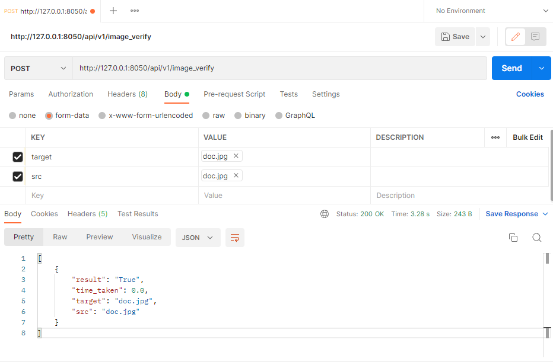
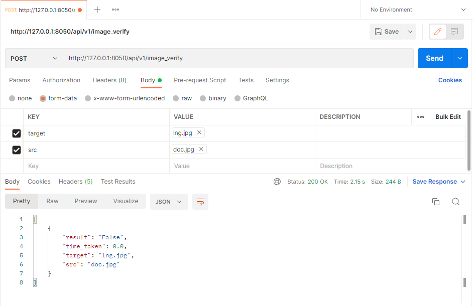
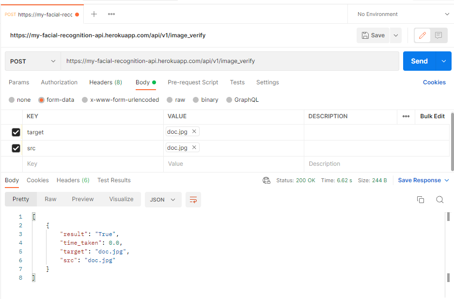

# My Facial Recognition Api
 Verifying the possibility that two faces are those of the same person. 
 Return Successful Image  if both images match and Unsuccessful Image otherwise. 

## REQUIREMENT 

```
pip install face_recognition
pip install scipy
pip install https://github.com/jloh02/dlib/releases/download/v19.22/dlib-19.22.99-cp310-cp310-win_amd64.whl
pip install flask
pip install gunicorn
pip freeze > requirements.txt


```

## TESTING

 
```
A:
python image_verify.py public/img/lng.jpg   public/img/doc.jpg
```
> Returns Unsuccessful Image Matching  !! 


```
B :
python image_verify.py public/img/lng.jpg   public/img/lng.jpg
```
> Returns Successful Image Matching  !! 

```
C:
 python api.py
 ```
 > Returns Running on http://127.0.0.1:8050


## ***PREVIEW***

| SUCCESS RESPONSE | FAILED RESPONSE | LIVE  RESPONSE|
|     ------------- | ------------- | -----------|
| | | |


## TOOLS & PLATFORM
- Python Version: 3.10
- dlib Version: 19.22.99
- CMAKE
- GIT and GITHUB
- VS CODE
- POSTMAN
- Platform: Windows 10 64-bit


## TODO

- [x] Build Image Verify

- [x] Build Image Verify API

- [x] Launch the project on a live server.

- [] Android Client App.

- [] IOS Client App.


## LIVE API ENDPOINT
https://my-facial-recognition-api.herokuapp.com/api/v1/image_verify